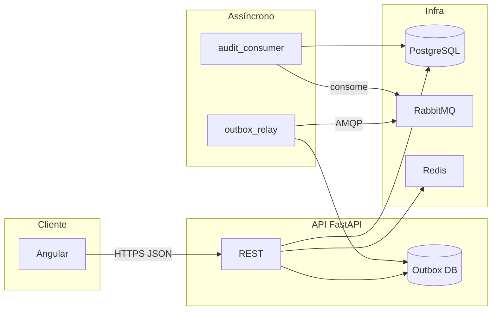
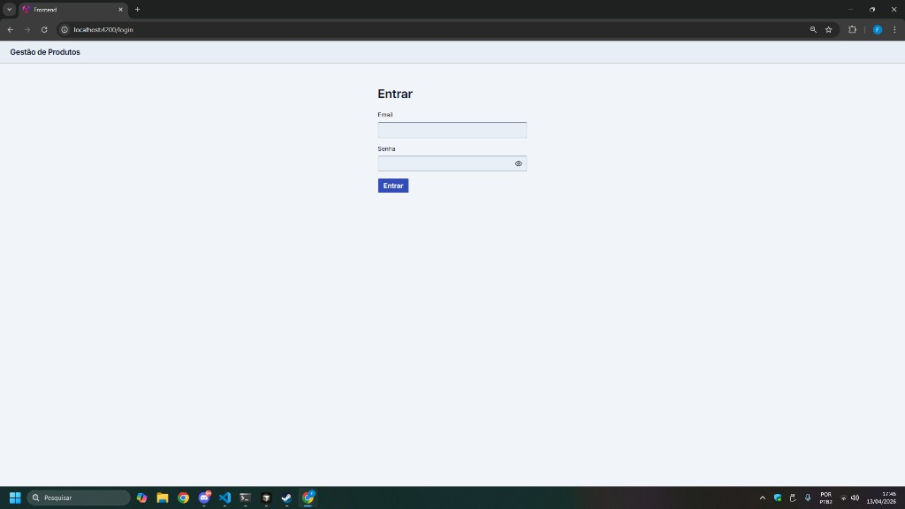
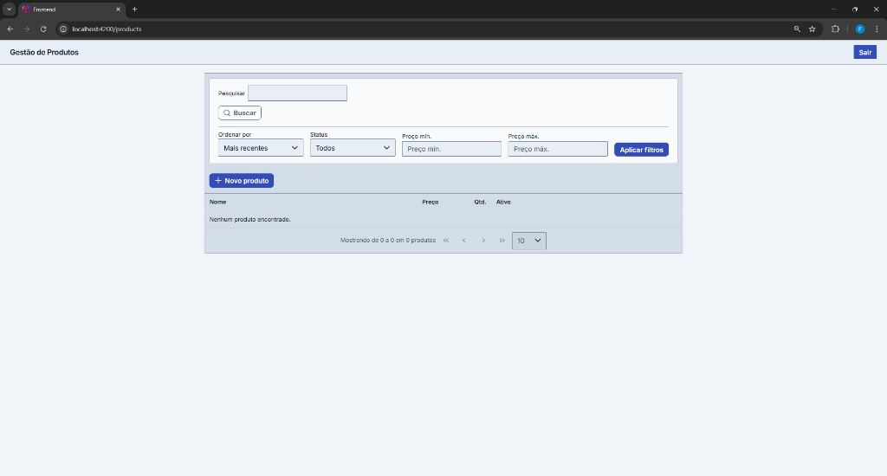
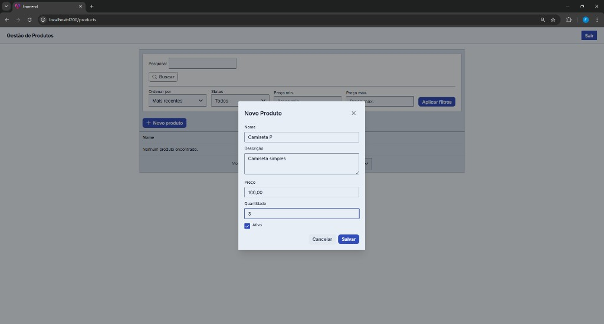
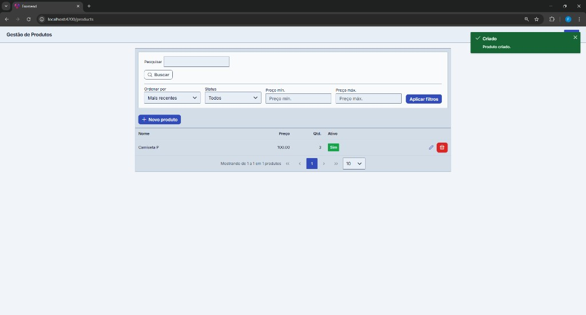
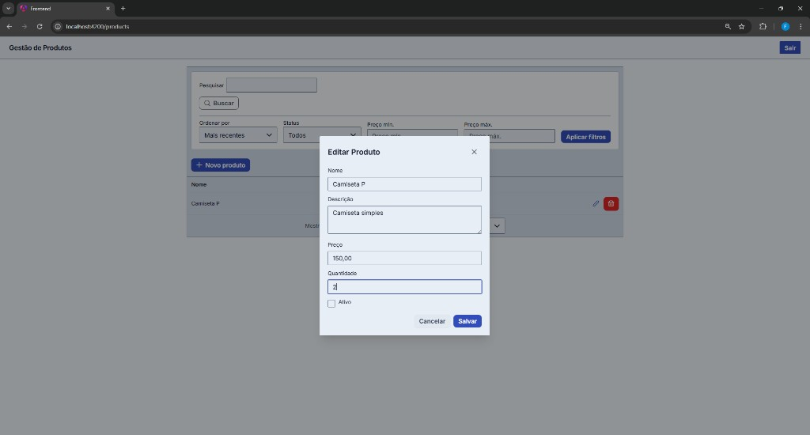
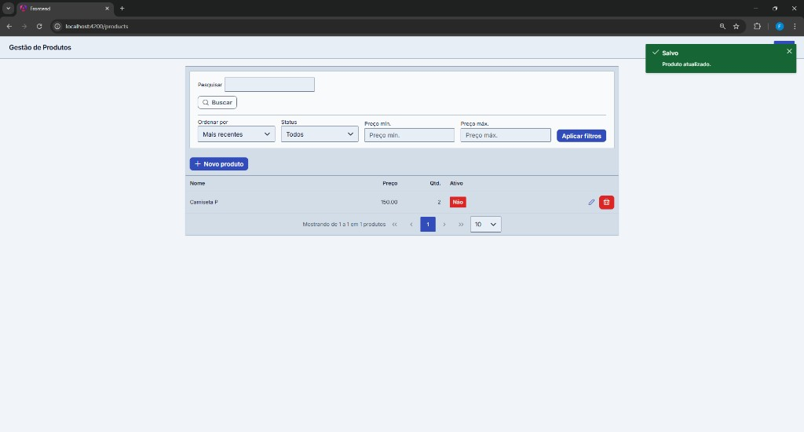

# Desafio Full Stack — Gestão de Produtos

## 1. Visão geral do projeto

Uma aplicação web para **cadastro e gestão de produtos**: após autenticação, as operações realizadas na interface são persistidas no backend e expostas de forma consistente pela API REST. Por baixo do CRUD há uma API FastAPI documentada no Swagger, e alterações relevantes geram eventos processados em segundo plano via RabbitMQ (auditoria assíncrona), sem bloquear a resposta ao usuário. O projeto foi pensado como entrega de desafio técnico: código organizado, segurança básica aplicada e instruções claras para subir tudo localmente.

## 2. Arquitetura resumida

- Frontend: Angular (SPA), rotas protegidas, formulários reativos, interceptor de auth, PrimeNG (17–21).
- Backend: FastAPI em camadas (rotas, serviços, repositórios, schemas Pydantic, workers).
- Persistência: PostgreSQL (SQLAlchemy + Alembic).
- Mensageria: RabbitMQ com outbox na API, relay no broker e consumer de auditoria assíncrona.
- Redis: refresh opaco, blacklist por JTI após logout, rate limit no login.



## 3. Principais decisões técnicas

| Decisão | Justificativa breve |
|--------|----------------------|
| **PostgreSQL** | Relacional, adequado ao modelo de produtos/usuários, integridade e migrações versionadas (Alembic). |
| **JWT (access) + refresh opaco no Redis** | Atende login seguro, renovação e logout com invalidação (JTI na deny list + remoção do refresh). |
| **Outbox + relay** | Garante publicação de eventos consistente com a transação do domínio; evita “RabbitMQ de adorno”. |
| **Retry + DLQ no RabbitMQ** | Falhas transitórias com `nack` e fila de retry com TTL; após limite de tentativas, mensagem vai para DLQ. |
| **Idempotência no consumer** | `event_id` registrado (`ProcessedEvent`); reprocessamento duplicado vira `ack` sem duplicar auditoria. |
| **CORS com allowlist** | Origins, métodos e headers explícitos. |
| **Logs JSON + `X-Request-ID`** | Observabilidade mínima: correlacionar requisição na API; worker com campo `service`. |

## 4. Stack tecnológica

| Camada | Tecnologias (referência) |
|--------|---------------------------|
| Frontend | Angular ~21, PrimeNG ~21, TypeScript ~5.9, RxJS |
| Backend | Python 3.12, FastAPI, Uvicorn, SQLAlchemy 2, Pydantic v2, Alembic, python-jose, passlib/bcrypt |
| Mensageria | RabbitMQ 3 (pika), exchanges topic + DLX |
| Cache / sessão auxiliar | Redis 7 |
| Dados | PostgreSQL 16 |
| Testes (backend) | pytest, httpx |
| Contêineres | Docker, Docker Compose |

## 5. Estrutura do repositório

```
.
├── docker-compose.yml      # Stack local: db, rabbitmq, redis, api, frontend, outbox-relay, worker
├── .env-example            # Modelo de variáveis (copiar para .env na raiz)
├── backend/
│   ├── app/
│   │   ├── api/routes/     # Endpoints HTTP (auth, products)
│   │   ├── core/           # Config, segurança, limiter, Redis, middlewares, logging
│   │   ├── db/             # Sessão SQLAlchemy
│   │   ├── messaging/      # Eventos, topologia AMQP, publisher
│   │   ├── models/         # ORM (User, Product, Outbox, auditoria, idempotência)
│   │   ├── repositories/   # Acesso a dados
│   │   ├── schemas/        # Pydantic (entrada/saída)
│   │   ├── services/       # Regras de negócio (auth, produtos)
│   │   └── workers/        # outbox_relay, audit_consumer
│   ├── alembic/            # Migrações
│   ├── scripts/seed_admin.py
│   ├── Dockerfile
│   └── requirements.txt
├── frontend/
│   ├── src/app/            # Módulos, páginas, guards, interceptors, serviços
│   ├── Dockerfile
│   └── package.json
├── imgs/                   # Capturas da interface (seção 14)
└── docs/                   # opcional — coleção Postman/Insomnia (ainda não no repo)
```

## 6. Pré-requisitos

- Docker e Docker Compose (caminho recomendado).
- Alternativa local: Python 3.12, Node.js 22+, npm; PostgreSQL, RabbitMQ e Redis acessíveis (ou só a infra via Compose).

## 7. Configuração de ambiente

1. Na raiz do monorepo, copie o modelo de variáveis:

   ```bash
   cp .env-example .env
   ```

2. Ajuste valores sensíveis e URLs. Referência: [`.env-example`](./.env-example).

| Variável | Uso |
|----------|-----|
| `DATABASE_URL` | PostgreSQL ao correr API/workers na máquina (ex.: `localhost`) |
| `TEST_DATABASE_URL` | Banco para pytest local |
| `JWT_SECRET_KEY` | Assinatura dos JWT (trocar em produção) |
| `JWT_ALGORITHM`, `ACCESS_TOKEN_EXPIRE_MINUTES`, `REFRESH_TOKEN_EXPIRE_DAYS` | Tempo de vida dos tokens |
| `RABBITMQ_URL` | AMQP no host local |
| `REDIS_URL` | Redis no host local (refresh, deny list, rate limit) |
| `MESSAGING_RETRY_TTL_MS`, `MESSAGING_MAX_ATTEMPTS` | Retry/DLQ no consumer |
| `OUTBOX_BATCH_SIZE`, `OUTBOX_POLL_INTERVAL_SECONDS` | Relay do outbox |
| `CORS_ORIGINS`, `CORS_ALLOW_CREDENTIALS` | CORS restritivo |
| `RATE_LIMIT_LOGIN_PER_MINUTE` | Limite de tentativas de login |
| `APP_NAME`, `DEBUG` | Metadados da aplicação |
| `COMPOSE_DATABASE_URL` | (opcional) sobrescreve URL da BD dentro dos containers |
| `COMPOSE_RABBITMQ_URL` | (opcional) sobrescreve AMQP nos containers |
| `COMPOSE_REDIS_URL` | (opcional) sobrescreve Redis nos containers |
| `COMPOSE_TEST_DATABASE_URL` | (opcional) sobrescreve BD de testes no serviço `test` |

Os serviços `api`, `outbox-relay`, `worker` e `test` no [`docker-compose.yml`](./docker-compose.yml) usam por defeito os hosts da rede Docker (`db`, `rabbitmq`, `redis`), sem ler `DATABASE_URL` / `RABBITMQ_URL` / `REDIS_URL` do `.env` — assim um `.env` com `localhost` não quebra o Compose. Ver comentário no topo do ficheiro para overrides.

## 8. Como executar

### Opção A — Stack completa (Docker Compose)

Na raiz do monorepo:

```bash
docker compose up -d --build
```

O serviço `api` roda na subida: `alembic upgrade head`, `python -m scripts.seed_admin` (idempotente) e Uvicorn. Aguarde o healthcheck da API; o frontend depende disso.

- API: http://localhost:8000  
- Frontend: http://localhost:4200  
- Swagger: http://localhost:8000/docs  
- RabbitMQ Management: http://localhost:15672 (`guest` / `guest`)

Serviços: `api`, `frontend`, `outbox-relay`, `worker`, `db`, `rabbitmq`, `redis`.

Migrações e seed já fazem parte do comando de entrada do `api`.

Credenciais de teste: `admin@exemplo.com` / `admin`.


## 9. Documentação da API (Swagger / OpenAPI)

- URL: http://localhost:8000/docs (esquema em `/openapi.json`).
- Tags: `auth` (login, refresh, logout, me), `products` (CRUD protegido), `health` (`/health`, `/ready`).
- Descrições e respostas alinhadas à convenção de erros uniforme do backend.

## 10. Fluxo do produto (jornada do usuário)

1. Login com credenciais válidas; access (e refresh) guardados e o Bearer enviado pelo interceptor.
2. Listagem com paginação e filtros (nome, ativo, faixa de preço, ordenação).
3. Criação e edição em formulário reativo; remoção com confirmação.
4. Estados de UI: carregamento, vazio e erro na listagem e nos formulários.
5. Resposta 401 em rotas protegidas: o interceptor tenta renovar o access com `POST /auth/refresh` (fora do interceptor); se o refresh falhar, limpa a sessão local e redireciona ao login.
6. Logout chama a API: invalida o access (JTI na deny list no Redis) e remove o refresh opaco quando enviado no body.

## 11. Fluxo real no RabbitMQ

1. Evento: em criação, atualização e exclusão de produto, o `ProductService` grava uma linha em `outbox_events` (payload JSON do `ProductChangedEvent`: `event_id`, `event_type`, `actor_user_id`, snapshot do produto).
2. Producer: o worker `outbox_relay` lê o outbox, publica no exchange `products.events` (topic) com routing key `product.created` / `product.updated` / `product.deleted`, e marca `published_at`.
3. Consumer: `audit_consumer` consome da fila principal, persiste em `product_audit_log` e `processed_events` (idempotência por `event_id`).
4. Falhas: `nack` sem requeue → fila de retry (TTL) e volta ao exchange; após limite de tentativas (`x-death`), DLQ `products.audit.dlq`.

## 12. Notas de segurança

- Senhas: bcrypt (passlib); nunca em claro.
- Endpoints: CRUD de produtos e `/auth/me` exigem Bearer JWT; login com corpo validado.
- Refresh: token opaco no Redis com TTL; rotação em `POST /auth/refresh`.
- Logout: `deny:jti:<jti>` no Redis até expirar o access; `get_current_user` rejeita JTI listado.
- Rate limiting: login por IP (SlowAPI + Redis).
- Middleware: `X-Content-Type-Options`, `X-Frame-Options`, `Referrer-Policy`, `Permissions-Policy`.
- CORS: origins e headers explícitos (inclui `X-Request-ID`).

## 13. Testes e qualidade

- Manual: login → CRUD → Swagger; opcionalmente filas no RabbitMQ Management e logs de `api`, `outbox-relay`, `worker`.
- Automatizados: pytest em `backend/tests` (auth, produtos, mensageria/outbox, etc.).

  Com Compose (perfil `test`):

  ```bash
  docker compose --profile test run --rm test
  ```

### 13.1 Observabilidade

- Logs: JSON no stdout da API (`request_id` quando aplicável) e nos workers (campo `service`, ex. `outbox_relay`, `audit_consumer`).
- Correlação: header `X-Request-ID` (a API devolve o mesmo valor na resposta).

  ```bash
  docker compose logs -f api
  docker compose logs -f worker
  docker compose logs -f outbox-relay
  ```

- Saúde: `GET /health` (liveness); `GET /ready` com `SELECT 1` no Postgres e `PING` no Redis (503 se falhar — healthcheck do Compose).

## 14. Evidências de UI (capturas de tela)

Imagens em [`imgs/`](./imgs/) (Angular em http://localhost:4200).

### Login



### Listagem (estado vazio)



### Criação de produto (modal)



### Produto criado (confirmação)



### Edição de produto (modal)



### Produto atualizado (confirmação)



## 15. Escopo e melhorias futuras

- Sem CRUD de utilizadores na API: operador padrão via `scripts/seed_admin`.
